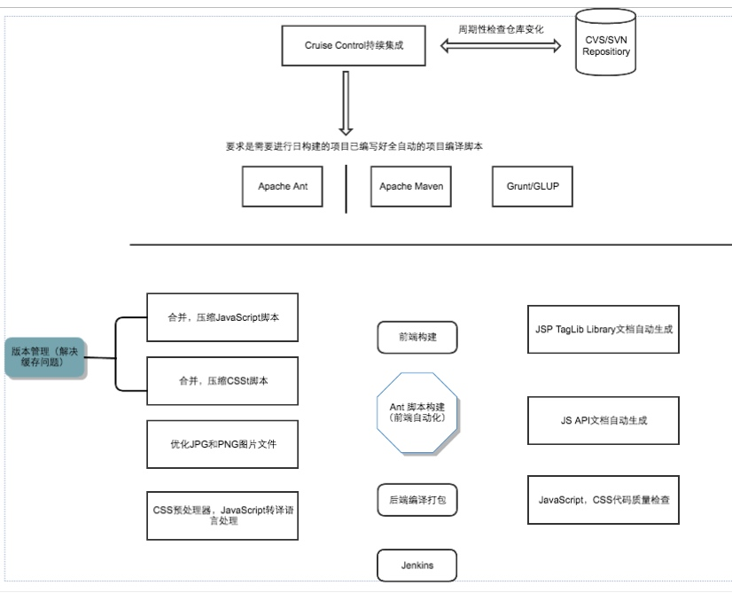

## 思路整理

首先，先理一下自己认知中的集成解决方案应该包含哪些部分：

Beta1：

| 内容 | 状态 | 备注 |
| --- | --- | --- |
|  项目文档 | 已进行 | 包括项目设计文档，API文档等  |
| 源代码管理 |未进行|包管理,模块化,组件化|
|单元测试|未进行|模块测试，接口测试，函数测试|
|集成测试|未进行|整个功能块测试|
|部署|未进行|根据项目部署环境,建立部署脚本|

根据别人的前端集成解决方案:

```
1.开发规范：包括开发、部署的目录规范，编码规范等。不要小瞧规范的威力，可以极大的提升开发效率，真正优秀的规范不会让使用者感到约束，而是能帮助他们快速定位问题，提升效率。

2.模块化开发：针对js、css，以功能或业务为单元组织代码。js方面解决独立作用域、依赖管理、api暴露、按需加载与执行、安全合并等问题，css方面解决依赖管理、组件内部样式管理等问题。是提升前端开发效率的重要基础。现在流行的模块化框架有requirejs、seajs等。

3.组件化开发：在模块化基础上，以页面小部件(component)为单位将页面小部件的js、css、html代码片段放在一起进行开发、维护，组件单元是资源独立的，组件在系统内可复用。比如头部(header)、尾部(footer)、搜索框(searchbar)、导航(menu)、对话框(dialog)等，甚至一些复杂的组件比如编辑器(editor)等。通常业务会针对组件化的js部分进行必要的封装，解决一些常见的组件渲染、交互问题。

4.组件仓库：有了组件化，我们希望将一些非常通用的组件放到一个公共的地方供团队共享，方便新项目复用，这个时候我们就需要引入一个组件仓库的东西，现在流行的组件库有bower、component等。团队发展到一定规模后，组件库的需求会变得非常强烈。

5.性能优化：这里的性能优化是指能够通过工程手段保证的性能优化点

6.项目部署：部署按照现行业界的分工标准，虽然不是前端的工作范畴，但它对性能优化有直接的影响，包括静态资源缓存、cdn、非覆盖式发布等问题。合理的静态资源资源部署可以为前端性能带来较大的优化空间。


```

一张持续集成的构成图



现环境下常用的前端开源项目持续集成方案：

```

1、Mocha+Chai作单元测试，
2、Travis CI作项目持续集成，(企业的前端项目中一般不采用Travis CI作为持续集成，而是采用Jenkins)
3、Coveralls作测试代码覆盖率，
4、SauceLabs作跨浏览器集成测试。


```


团队1的workflow(weflow的前生)

```

1、gulp flow/webpack flow/fis flow + plug-ins开发
集成自动化流程
Less / Sass -> CSS 编译
CSS**** Autoprefixer 前缀自动补全
自动生成图片 CSS 属性，width & height 等
CSS cssnano 压缩
CSS Sprite 雪碧图合成
Retina @2x & @3x 自动生成适配
Imagemin 图片压缩
px -> rem 兼容适配方案
智能 WebP 解决方案
去缓存文件 Reversion (MD5) 解决方案
ES6/7的babel编译
JS 合并压缩按依赖加载
2、eslint作为代码检查工具
3、mocha+chai单元测试(不过很少有团队把这个作为项目的必须流程)
4、gitlab管理项目代码
5、gitlab hook+Jenkins自动部署dev/test/prod


```

团队1的workflow工具 [tmt](https://github.com/weixin/tmt-workflow)

[weFlow](https://github.com/weixin/WeFlow)

持续集成系统组成

```

使用git作为版本控制库
相比于同类项目版本系统，git有一项非常显著的优势，就是版本分支(branch)的合并(merge)十分方便。
使用docker搭建测试环境
作为一种新型的虚拟化方式，相对于传统的虚拟化方式有着众多的优势。例如，docker虚拟容器的启动可以在秒级实现，并且对系统资源的利用率很高。另外，docker的管理，迁移和扩展也更轻松有效。
使用jenkins作为持续集成服务器
Jenkins为开发人员提供了非常有效的持续集管理。其强大的插件系统和明确的构建逻辑，使得构建流程的创建非常简便。


```


## 前端构建

### FIS

### YEOMAN


## 测试一些细节

单元测试中，如果要测试的对象对其他类有依赖，我们会Stub/Mock的手段来将这些依赖消除，比如使用mockito/PowerMock

集成测试

系统内模块（一个模块对其周边的依赖项）间的集成，系统间的集成都可以归类为集成测试。比如

数据库访问模块与数据库的集成
对外部service依赖的测试，比如对第三方支付，通知等服务的集成
集成测试强调模块和外部的交互的验证，在集成测试时，通常会涉及到外部的组件，比如数据库，第三方服务。这时候需要尽可能真实的去与外部组件进行交互，比如使用和真实环境相同类型的数据库，采用独立模式（Standalone）的WireMock来启动外部依赖的RESTful系统。

通常会用来做模拟外部依赖工具包括：

WireMock
mountebank


